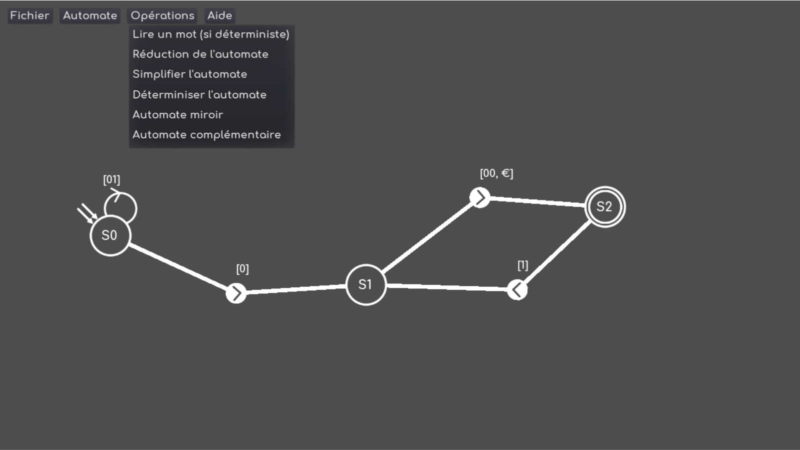
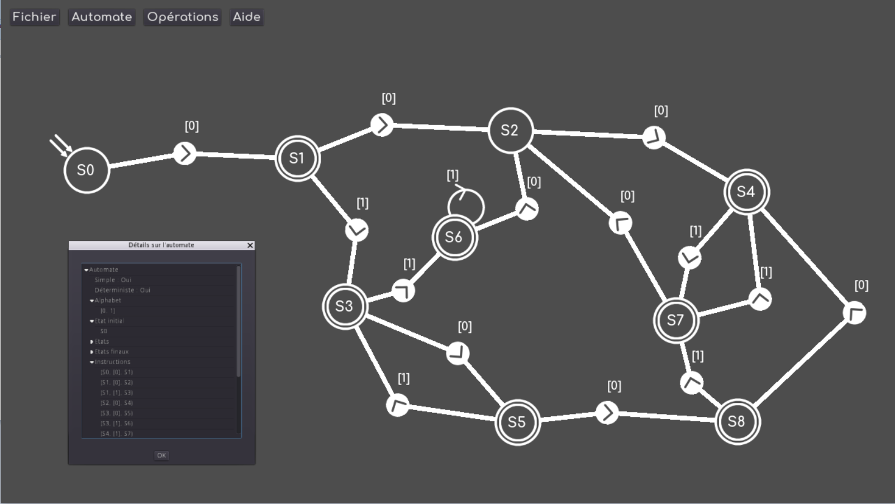
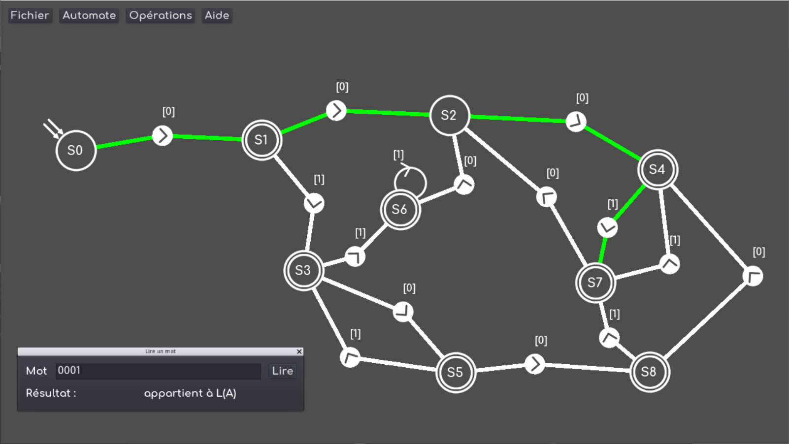

# Automates
 
Finite-state machine app made with [Godot Engine](https://github.com/godotengine/godot).

## Downloads 
[Windows](https://github.com/MrRedaM/Automates/releases/download/v0.9/automates_win64.rar)

[Mac OS](https://github.com/MrRedaM/Automates/releases/download/v0.9/automates_macOS.zip)

[Linux](https://github.com/MrRedaM/Automates/releases/download/v0.9/automates_linux_X11.rar)

## Screenshots

